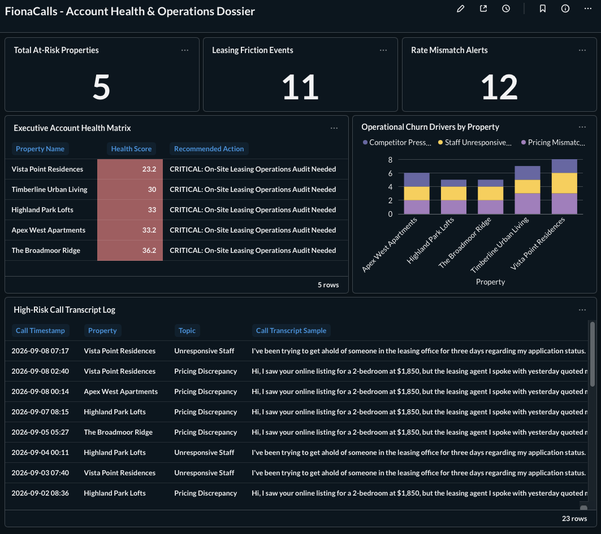

# Unstructured Call Intelligence & CRM Churn Analytics Pipeline

An end-to-end data pipeline that ingests unstructured call transcript data, extracts operational churn signals using dbt-style modeling logic in **DuckDB**, and exposes actionable account health dashboards via **Metabase**.

Built as a proof-of-concept for bridging raw event logs with executive decision-making in high-touch agency (e.g., Digible FionaCalls) and legal intake CRM environments.

---

## 📸 Dashboard Overview



---

## 🏗 Architecture & Medallion Pipeline

The pipeline follows a multi-hop Medallion Architecture (**Raw → Staging → Gold Mart**) to decouple raw data storage from analytical business logic.

```text
┌──────────────────────────────────────────────────────┐
│                    Raw Transcripts                    │
│      (Unstructured text, timestamps, metadata)         │
└───────────────────────────┬────────────────────────────┘
                             │
                             ▼
┌──────────────────────────────────────────────────────┐
│              Silver Layer (Staging Model)              │
│           fionacalls.stg_structured_calls              │
│  • Categorical extraction (pricing, friction, risk)     │
│  • Sentiment scoring (-1.0 to +1.0)                     │
│  • Boolean flags for downstream aggregations            │
└───────────────────────────┬────────────────────────────┘
                             │
                             ▼
┌──────────────────────────────────────────────────────┐
│               Gold Layer (Business Mart)                │
│           fionacalls.gold_account_health                │
│  • Weighted account health score (0–100)                │
│  • Automated agency action queue                        │
└───────────────────────────┬────────────────────────────┘
                             │
                             ▼
┌──────────────────────────────────────────────────────┐
│               Metabase Action Dossier                   │
│    (KPI summary, risk heatmap, transcript queue)         │
└──────────────────────────────────────────────────────┘
```

---

## 🛠 Tech Stack

| Layer | Tool |
|---|---|
| Data Engine | DuckDB (embedded OLAP database) |
| Transformation / Pipeline | Python (`duckdb`, `sqlite3`) |
| Presentation Layer | Metabase (Dockerized) |
| Portable Storage Layer | SQLite |

---

## 📊 Core Business Metrics & Logic

### 1. Silver Staging Flags

Extracts specific operational risk indicators from raw call text:

- **`flag_pricing_mismatch`** — detects pricing discrepancies between advertised marketing channels and leasing office staff
- **`flag_leasing_friction`** — identifies leasing office unresponsiveness, dropped leads, or long hold times
- **`flag_competitor_risk`** — tracks prospective client mentions of competing market rates

### 2. Gold Account Health Score (0–100)

A weighted operational score driving automated priority queues:

$$\text{Health Score} = 100 - (\text{Pricing Mismatches} \times 12) - (\text{Leasing Friction} \times 10) - (\text{Competitor Risk} \times 8)$$

### 3. Automated Agency Actions

Categorizes properties into operational tiers:

| Score | Action |
|---|---|
| < 60 | 🔴 **CRITICAL** — On-site leasing operations audit needed |
| 60–75 | 🟡 **WARNING** — Review rate syndication & response times |
| > 75 | 🟢 **HEALTHY** — Maintain standard campaign cadence |

---

## 🚀 How to Run Locally

### Prerequisites

- Python 3.9+
- Docker Desktop

### 1. Clone & set up the data environment

```bash
git clone https://github.com/dustin-meyer/crm-call-intelligence.git
cd digible_exercise

# Install dependencies
pip install duckdb
```

### 2. Execute the data generator & SQLite conversion

```bash
# Generate synthetic transcripts & build DuckDB Silver/Gold layers
python data_generator.py

# Export models to SQLite for instant Metabase compatibility
python plugins/convert_to_sql_lite.py
```

### 3. Launch the Metabase dashboard

```bash
docker run -d -p 3000:3000 \
  -v "$(pwd):/data" \
  --name metabase metabase/metabase
```

Then:

1. Open [http://localhost:3000](http://localhost:3000) in your browser.
2. Select **SQLite** as the database type.
3. Set the database path to `/data/digible_analytics.db`.